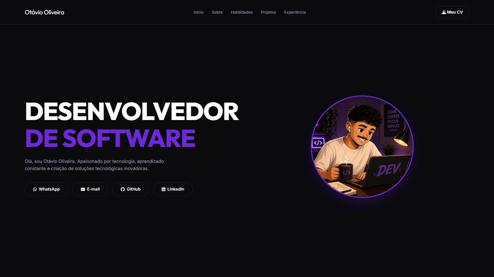

<div align="center">

# OtavioDev — Portfólio Pessoal (v1)

Primeira versão do meu portfólio pessoal: single page com apresentação, habilidades, projetos com mockups, experiência e contato, construída com HTML, CSS e JavaScript puros e rolagem suave via Lenis.




[](https://otavio-2507.github.io/OtavioDev/)
[](https://github.com/OTAVIO-2507/OtavioDev)

</div>

> Este repositório corresponde à primeira versão do portfólio. A versão atual, reconstruída com arquitetura multi-arquivo e efeitos 3D, está em [Portifolio-v2](https://github.com/OTAVIO-2507/Portifolio-v2).

## Visão geral

O site apresenta minha trajetória como desenvolvedor em uma única página: hero com chamada principal e links de contato, seção sobre, habilidades, projetos em destaque com mockups dedicados, experiência profissional e currículo em PDF disponível para download. A navegação usa rolagem suave (Lenis) e a interface segue um tema escuro com destaque em roxo.

## Funcionalidades

- Single page com navegação por âncoras e rolagem suave (Lenis)
- Hero com links diretos para WhatsApp, e-mail, GitHub e LinkedIn
- Projetos em destaque com mockups produzidos para cada aplicação
- Seções de habilidades e experiência profissional
- Currículo em PDF disponível no repositório
- Tema escuro com identidade visual própria

## Decisões de projeto

Algumas escolhas que não são óbvias pelo código:

**Os links âncora passam pelo Lenis, não pelo navegador.** Com rolagem suave por biblioteca, o salto nativo de âncora briga com a interpolação e produz um solavanco. Por isso todo `a[href^="#"]` tem o comportamento padrão cancelado e delega para `lenis.scrollTo`: existe um só motor de rolagem na página.

**A barra some ao descer e volta ao subir.** A comparação com `lastScrollY` dá a direção do gesto, e o limiar de 80px evita que ela pisque durante os primeiros pixels. Esconder no sentido da leitura devolve altura de tela justamente quando a pessoa está consumindo conteúdo.

**O menu aberto tranca a rolagem do corpo.** Sem `body.style.overflow = 'hidden'`, a página continua rolando atrás do painel e a pessoa perde a posição ao fechar.

**O menu se fecha sozinho ao passar de 900px.** Redimensionar a janela com o painel aberto deixaria um estado que não existe no desktop — o overlay em uma largura onde o CSS já não o desenha, e a rolagem travada sem nada visível explicando o motivo.

## Tecnologias

| Tecnologia | Aplicação no projeto |
| --- | --- |
| HTML5 | Estrutura semântica da página |
| CSS3 | Tema escuro, layout e responsividade |
| JavaScript | Interações e navegação |
| Lenis | Rolagem suave |
| Font Awesome | Iconografia |

## Como executar

```bash
git clone https://github.com/OTAVIO-2507/OtavioDev.git
cd OtavioDev
```

Abra o arquivo `index.html` no navegador. As dependências são carregadas via CDN.

## Estrutura do projeto

```
OtavioDev/
├── index.html              Página única do portfólio
├── src/
│   ├── css/style.css       Estilos do site
│   ├── javascript/         Interações
│   └── img/                Imagens, logos e mockups dos projetos
├── Mockups/                Mockups dos projetos em destaque
└── Currículo - Otávio Oliveira.pdf
```

