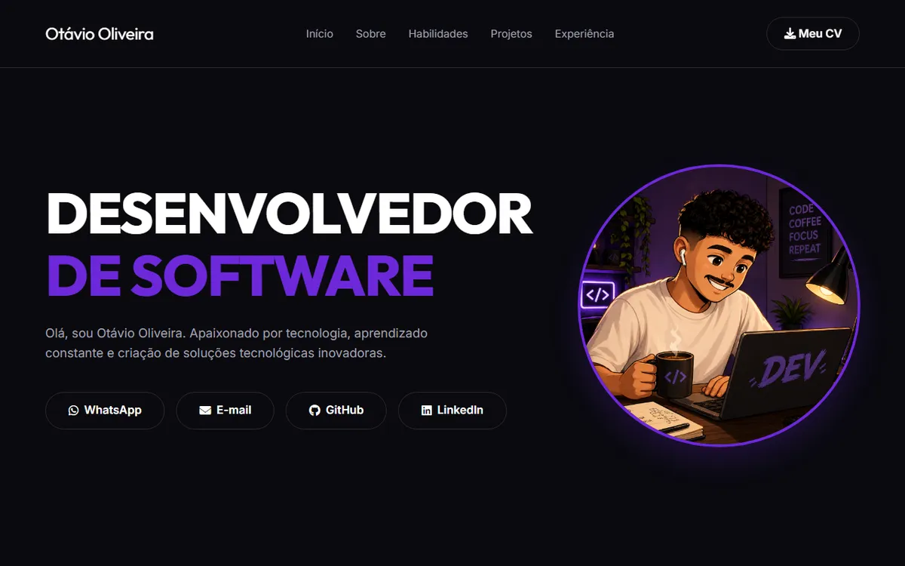

# OtavioDev — Portfólio Pessoal (v1)

Primeira versão do meu portfólio pessoal: single page com apresentação, habilidades, projetos com mockups, experiência e contato, construída com HTML, CSS e JavaScript puros e rolagem suave via Lenis.


[](https://otavio-2507.github.io/OtavioDev/)

[](https://otavio-2507.github.io/OtavioDev/)

> Este repositório corresponde à primeira versão do portfólio. A versão atual, reconstruída com arquitetura multi-arquivo e efeitos 3D, está em [Portifolio-v2](https://github.com/OTAVIO-2507/Portifolio-v2).

## Visão geral

O site apresenta minha trajetória como desenvolvedor em uma única página: hero com chamada principal e links de contato, seção sobre, habilidades, projetos em destaque com mockups dedicados, experiência profissional e currículo em PDF disponível para download. A navegação usa rolagem suave (Lenis) e a interface segue um tema escuro com destaque em roxo.

## Funcionalidades

- Single page com navegação por âncoras e rolagem suave (Lenis)
- Hero com links diretos para WhatsApp, e-mail, GitHub e LinkedIn
- Projetos em destaque com mockups produzidos para cada aplicação
- Seções de habilidades e experiência profissional
- Currículo em PDF disponível no repositório
- Tema escuro com identidade visual própria

## Tecnologias

| Tecnologia | Aplicação no projeto |
| --- | --- |
| HTML5 | Estrutura semântica da página |
| CSS3 | Tema escuro, layout e responsividade |
| JavaScript | Interações e navegação |
| Lenis | Rolagem suave |
| Font Awesome | Iconografia |

## Como executar

```bash
git clone https://github.com/OTAVIO-2507/OtavioDev.git
cd OtavioDev
```

Abra o arquivo `index.html` no navegador. As dependências são carregadas via CDN.

## Estrutura do projeto

```
OtavioDev/
├── index.html              Página única do portfólio
├── src/
│   ├── css/style.css       Estilos do site
│   ├── javascript/         Interações
│   └── img/                Imagens, logos e mockups dos projetos
├── Mockups/                Mockups dos projetos em destaque
└── Currículo - Otávio Oliveira.pdf
```

## Autor

**Otávio Oliveira** — Desenvolvedor Full Stack

[GitHub](https://github.com/OTAVIO-2507) · [Portfólio atual](https://otavio-2507.github.io/Portifolio-v2/) · [E-mail](mailto:56otavio@gmail.com)
